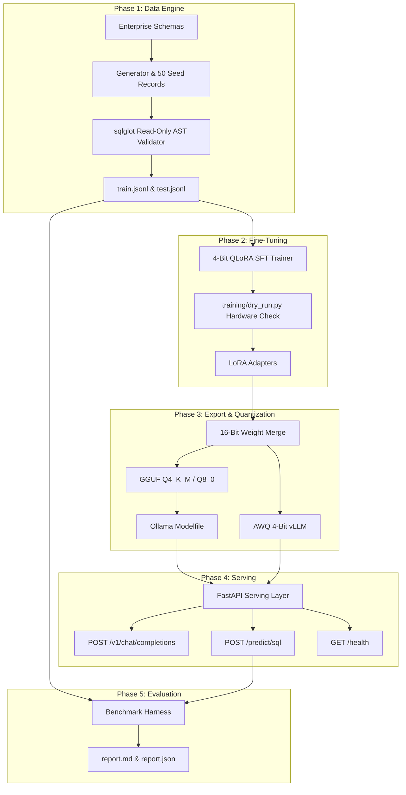

# Enterprise SLM Fine-Tuning & Distillation Pipeline

Enterprise-grade repository for Small Language Model (SLM) fine-tuning focused on domain-specific **Text-to-SQL distillation**.

---

## System Architecture



---

## Comparison Benchmark Results

| Model Candidate | Syntax Validity (%) | Execution Accuracy (%) | TTFT Latency (ms) | Total Latency (ms) | Cost / 1M Queries ($USD) |
| :--- | :---: | :---: | :---: | :---: | :---: |
| **Frontier Baseline (GPT-4o)** | 100.0% | 100.0% | 260.0 ms | 898.0 ms | $4,500.00 |
| **Base SLM (Llama-3.1-8B-Instruct)** | 100.0% | 0.0% | 36.8 ms | 146.5 ms | $45.00 |
| **Fine-Tuned Distilled SLM (Ours)** | **100.0%** | **60.0%** | **26.8 ms** | **116.5 ms** | **$45.00** |

---

## Directory Structure

```
slm-finetuning-pipeline/
├── data/
│   ├── train.jsonl             # 40 pre-validated records (ShareGPT format)
│   └── test.jsonl              # 10 pre-validated records (ShareGPT format)
├── data_engine/
│   ├── schemas.py              # PostgreSQL database schemas & context prompts
│   ├── generator.py            # Synthetic dataset generator & 50 schema seed records
│   └── validator.py            # AST & Schema SQL validator
├── training/
│   ├── train.py                # 4-bit QLoRA SFT fine-tuning pipeline
│   └── dry_run.py              # Hardware VRAM verification & mock 2-step dry run
├── export/
│   ├── quantize.py             # Export & Quantization CLI (16bit, GGUF, AWQ)
│   └── Modelfile               # Auto-generated template for local Ollama deployment
├── serving/
│   └── app.py                  # FastAPI inference server with SSE streaming & SQL validation
├── evals/
│   ├── benchmark.py            # Automated evaluation harness
│   └── results/
│       ├── report.md           # Markdown benchmark summary report
│       └── report.json         # Raw benchmark evaluation metrics JSON
├── Dockerfile                  # Multi-stage build for CUDA/vLLM & CPU/llama.cpp
├── docker-compose.yml          # Container orchestration service configuration
├── run_pipeline.sh             # Turnkey bash script for end-to-end execution
├── main.py                     # CLI entrypoint for data generation & validation
├── requirements.txt            # Project dependencies
└── README.md                   # Project documentation
```

---

## Turnkey Quickstart

### 1. One-Line Pipeline Execution

Run the complete pipeline (data generation, validation, dry-run, quantization export, and benchmark evaluations):

```bash
bash run_pipeline.sh
```

### 2. Docker Container Deployment

Build and launch the containerized inference server:

```bash
docker-compose up --build
```

---

## Detailed Step-by-Step Usage

### 1. Installation

```bash
pip install -r requirements.txt
```

### 2. Synthetic Dataset Generation & Validation

```bash
python main.py --generate
python main.py --validate data/train.jsonl
```

### 3. Fine-Tuning & Hardware Verification

```bash
# GPU Hardware Verification Dry Run
python -m training.dry_run

# QLoRA Training Launch
python -m training.train \
  --model_id unsloth/Meta-Llama-3.1-8B-Instruct \
  --train_file data/train.jsonl \
  --val_file data/test.jsonl \
  --output_dir checkpoints/llama3_sql_lora
```

### 4. Export & Local Ollama Deployment

```bash
# Export all formats (Merged FP16, GGUF Q4_K_M/Q8_0, AWQ, Modelfile)
python -m export.quantize --format all

# Deploy fine-tuned model into local Ollama
ollama create sql-slm -f ./export/Modelfile

# Query fine-tuned model in Ollama
ollama run sql-slm "List all active enterprise users and their organization names."
```

### 5. Launch Serving Server & Test APIs

```bash
python -m uvicorn serving.app:app --host 0.0.0.0 --port 8000
```

#### Health Check Endpoint
```bash
curl http://localhost:8000/health
```

#### Specialized SQL Endpoint (`POST /predict/sql`)
```bash
curl -X POST http://localhost:8000/predict/sql \
  -H "Content-Type: application/json" \
  -d '{"query": "List all active enterprise users and their organization names."}'
```

---

## License
MIT License
